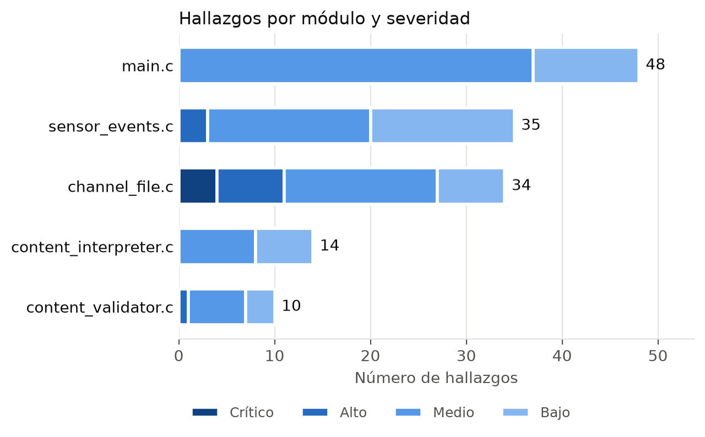
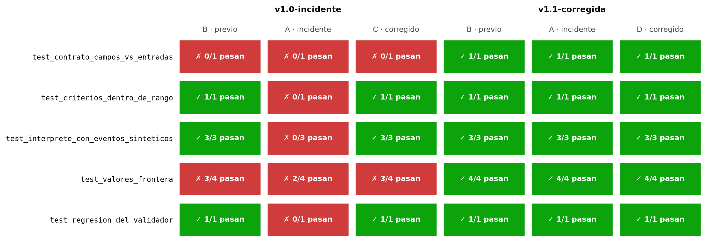
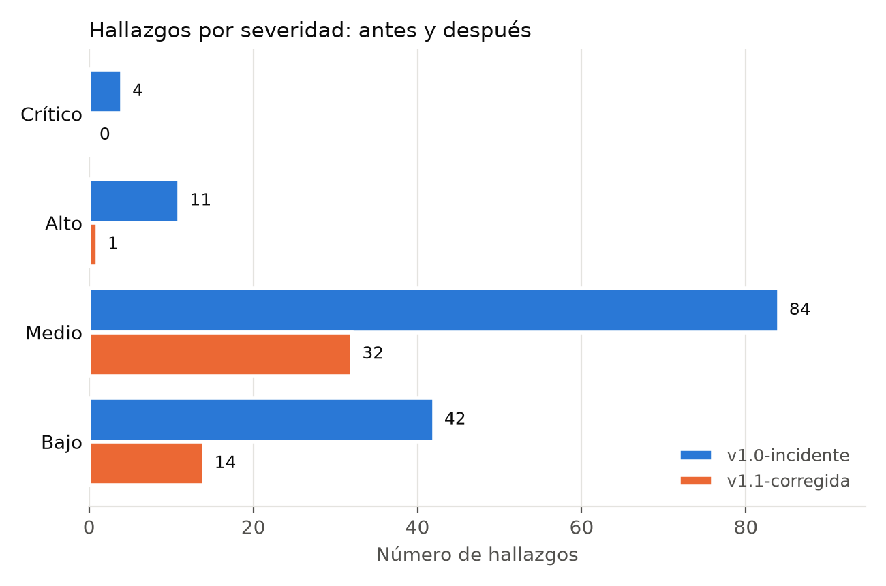

# Resultados del análisis

Este documento explica qué encontró cada herramienta sobre las dos versiones de falcon-sim y cómo
leer los reportes. Los datos corresponden a la ejecución del 07/10/2026 con Cppcheck 2.22.0 y
Apple clang 21. Todos los reportes están en la carpeta [reportes/](reportes/), y los HTML se pueden
abrir en el navegador:

| Reporte | v1.0 incidente | v1.1 corregida |
|---|---|---|
| PyTest | [pytest.html](https://lichundead.github.io/falcon-sim/reportes/v1.0-incidente/pytest.html) | [pytest.html](https://lichundead.github.io/falcon-sim/reportes/v1.1-corregida/pytest.html) |
| Cppcheck + MISRA C:2012 | [cppcheck-html](https://lichundead.github.io/falcon-sim/reportes/v1.0-incidente/cppcheck-html/index.html) | [cppcheck-html](https://lichundead.github.io/falcon-sim/reportes/v1.1-corregida/cppcheck-html/index.html) |
| Cobertura (llvm-cov) | [cobertura-html](https://lichundead.github.io/falcon-sim/reportes/v1.0-incidente/cobertura-html/index.html) | [cobertura-html](https://lichundead.github.io/falcon-sim/reportes/v1.1-corregida/cobertura-html/index.html) |

## Resumen

| Indicador | v1.0 incidente | v1.1 corregida |
|---|---|---|
| Hallazgos estáticos (Cppcheck y Clang) | 141 | 47 |
| Críticos / altos | 4 / 11 | 0 / 1 |
| Medios / bajos | 84 / 42 | 32 / 14 |
| Casos de PyTest aprobados | 18 de 30 | 30 de 30 |
| Accesos inválidos a memoria (AddressSanitizer) | 8 | 0 |
| Cobertura de líneas / funciones / ramas | 81.82 % / 81.25 % / 75.00 % | 89.22 % / 100 % / 71.09 % |
| Complejidad ciclomática máxima | 10 | 8 |

El análisis estático encontró muchos problemas reales en la v1.0, pero no el defecto que causa el
incidente. Ese defecto solo apareció en las pruebas
dinámicas.

## Análisis estático de la v1.0

Cppcheck reportó 125 hallazgos (114 de ellos son reglas MISRA C:2012) y Clang Static Analyzer 16.

| Categoría | Crítico | Alto | Medio | Bajo | Total |
|---|---|---|---|---|---|
| Seguridad | 0 | 9 | 0 | 9 | 18 |
| Rendimiento | 4 | 2 | 0 | 0 | 6 |
| Codificación | 0 | 0 | 84 | 30 | 114 |
| Mantenibilidad | 0 | 0 | 0 | 3 | 3 |
| Total | 4 | 11 | 84 | 42 | 141 |

Los cuatro hallazgos críticos son dos defectos en `channel_file.c`, líneas 41 y 44. Cuando falla
la lectura del encabezado del archivo, la función sale sin cerrar el archivo (CWE-775) ni liberar
la memoria (CWE-401). Clang reporta el mismo problema en la línea 41.

De los 11 altos, cinco son llamadas a `strcpy` sin control de tamaño (CWE-119), tres son usos del
resultado de `malloc` sin comprobar si es nulo (CWE-476) y uno es un `sscanf` sin ancho máximo.
Los otros dos son las fugas que repite Clang.

Los 84 medios son reglas MISRA obligatorias. Las más frecuentes son la 17.7 (valor de retorno sin
usar, 26 veces), la 21.6 (uso de `stdio`, 21) y la 15.6 (`if` o `for` sin llaves, 19). Los bajos
son reglas MISRA recomendadas, dos funciones que nadie llama y avisos de Clang sobre `rand` y
`fprintf`. Esos avisos son falsos positivos en este contexto: `rand` solo genera eventos de prueba
y `fprintf` usa formatos fijos.

`content_interpreter.c` contiene el defecto del incidente, la lectura del campo 21 en la línea 28,
y aun así solo tiene 14 hallazgos de severidad media y baja. Ninguna
herramienta reportó la lectura fuera de límites. El índice que se sale del arreglo viene de los
datos del Channel File y el tamaño del arreglo se define en `main.c`, así que un analizador que no
ejecuta el programa no puede relacionar las dos cosas.

La única pista fue la regla MISRA 2.7, que marcó que el parámetro `n_values` de `ci_evaluate`
(`content_interpreter.c:35`) nunca se usa. Ese parámetro trae el número de entradas del sensor, que
es justo el dato necesario para comprobar los límites. La regla es recomendada y quedó clasificada
como baja.

Lizard no encontró problemas de complejidad (máximo 10 en `main`, el promedio es 3.6) y reportó 0 %
de duplicación. La función `pattern_match` está copiada en dos módulos, pero son seis líneas, por
debajo del tamaño de bloque que Lizard compara; la regla MISRA 5.9 sí detectó el nombre repetido.

## Pruebas dinámicas

La suite de PyTest ([tests/test_channel_291.py](tests/test_channel_291.py)) ejecuta el binario
compilado con AddressSanitizer contra tres versiones del Channel File. En la v1.0 fallan 12 de 30
casos:

| Prueba | Qué comprueba | Resultado en la v1.0 |
|---|---|---|
| `test_contrato_campos_vs_entradas` | Que la plantilla y el sensor manejen el mismo número de campos | Falla con los tres archivos: la plantilla declara 21 y el sensor entrega 20 |
| `test_criterios_dentro_de_rango` | Que ningún criterio apunte a un campo sin valor | Falla solo con el archivo del incidente (IPC-003, campo 21) |
| `test_interprete_con_eventos_sinteticos` | Que el intérprete procese 200 eventos sin errores de memoria | Falla con el archivo del incidente: `stack-buffer-overflow` en `content_interpreter.c:28` |
| `test_valores_frontera` | Que con 19, 20, 21 y 22 entradas el intérprete no lea fuera de rango | Falla con 19 entradas en los tres archivos y con 20 en el del incidente |
| `test_regresion_del_validador` | Que el validador no acepte contenido que haga fallar al intérprete | Falla con el archivo del incidente: el validador lo aceptó |

La prueba de contrato es la más útil, porque falla incluso con el contenido anterior al incidente
(escenario B). El defecto ya estaba en el código antes del 19 de julio; solo faltaba un dato que lo
activara, y eso coincide con el análisis de causa raíz de CrowdStrike.

Durante las pruebas, la cobertura de la v1.0 fue de 81.82 % de líneas. Las tres funciones sin
ejecutar están en `sensor_events.c`: las dos que nadie llama y la copia de `pattern_match`. La cifra
es un mínimo, porque los procesos que AddressSanitizer detiene no guardan su registro de cobertura.

## Resultado de las correcciones (v1.1)

La v1.1 aplica la remediación del análisis de causa raíz: el sensor entrega 21 valores, el
intérprete comprueba límites y el validador rechaza criterios que apunten a campos sin valor.
También corrige los hallazgos críticos y altos (fugas, `malloc` sin verificar, `strcpy`, `sscanf`)
y las reglas MISRA obligatorias que no exigían cambiar la arquitectura.

Con la v1.1 pasan las 30 pruebas, incluido el archivo del incidente (escenario D), y los hallazgos
estáticos bajan de 141 a 47. Lo que queda:

- Un hallazgo alto en `content_validator.c:26`. Cppcheck avisa que la condición `j >= 21` nunca se
  cumple y que, si se cumpliera, el acceso quedaría fuera del arreglo. Es inofensiva mientras el
  sensor entregue 21 valores, pero la introdujo la propia corrección, por eso conviene repetir el
  análisis después de cada cambio.
- 24 casos de MISRA 21.6 y 5 de MISRA 21.3. El simulador es una herramienta de línea de comandos y
  necesita `stdio` y memoria dinámica, así que se aceptan como desviación.
- Los falsos positivos de Clang sobre `rand` y `fprintf`, que no cambian.
- La cobertura de ramas bajó de 75 % a 71.09 %, porque la v1.1 agregó caminos de error (archivo
  inexistente, memoria agotada, demasiadas instancias) que la suite todavía no prueba.

## Cómo leer los reportes

| Reporte | Qué mirar |
|---|---|
| `pytest.html` | Abre un caso fallido para ver la línea `SUMMARY: AddressSanitizer` con el archivo y la línea del error |
| `cppcheck-html/index.html` | Lista de hallazgos por archivo; cada uno enlaza a la línea del código |
| `cobertura-html/index.html` | Cobertura por archivo; dentro de `content_interpreter.c` de la v1.0, la línea 28 aparece ejecutada |
| `clang-sa.txt`, `lizard.txt` | Salida de texto de Clang Static Analyzer y de Lizard |
| `hallazgos.csv` | Todos los hallazgos con herramienta, regla, severidad, categoría, archivo, línea y CWE |
| `comparacion.md` | Comparación numérica entre la v1.0 y la v1.1 |
